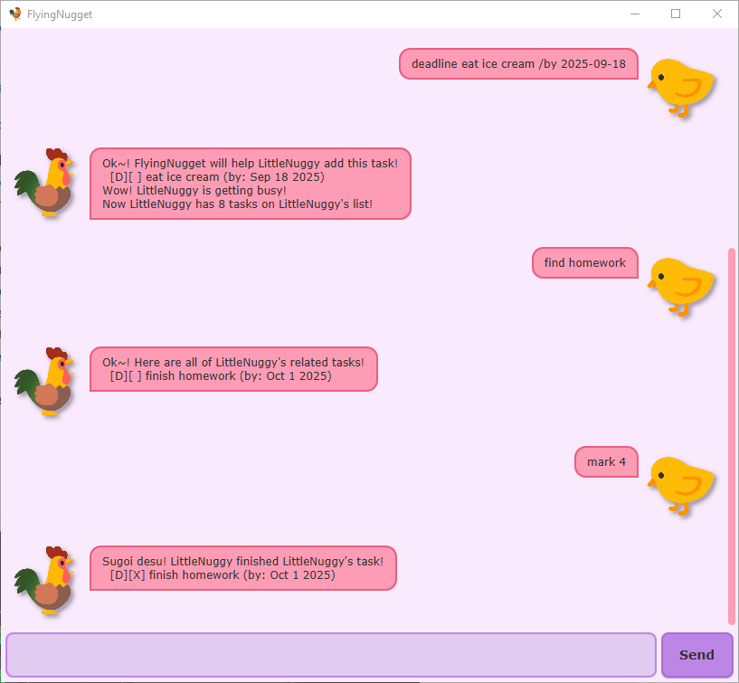

# FlyingNugget User Guide :chicken:

FlyingNugget is your premier option when it comes to task management! It has a fully designed Graphical User
Interface (GUI) and allows you to handle your tasks gracefully and efficiently. This application supports 3 different
types of tasks (todo, deadline and event), storage of task lists, and comes with multiple different commands to handle
them effectively.

---
## Commands
Here is a complete list of commands that the chatbot supports and examples of usage. Keywords are not case-sensitive.

- `list` — Shows the current list of tasks together with their task numbers and completion status.
    - Example: `list`

- `todo [task description]` — Creates a todo task of the given description.
    - Example: `todo finish homework`
    - Example: `todo chores`

- `deadline [task description] /by [due date]` — Creates a deadline task of the given description and due date.
    - Note: Dates are of the format 'YYYY-MM-DD'.
    - Example: `deadline submit quiz /by 2025-01-01`

- `event [task description] /from [start date] /to [end date]` — Creates an event task of the given description, start date, and end date.
    - Note: Dates are of the format 'YYYY-MM-DD'.
    - Example: `event project meeting /from 2025-03-04 /to 2025-03-05`

- `mark [task number]` —  Marks the task corresponding to the task number as completed.
    - Example: `mark 1`

- `unmark [task number]` — Unmarks the task corresponding to the task number.
    - Example: `unmark 6`

- `delete [task number]` — Deletes the task corresponding to the task number from the task list.
    - Example: `delete 4`

- `find [keyword(s)]` — Filters the list of tasks and shows the tasks that match the given keywords.
    - Example: `find homework`
    - Example: `find chores dishes`

- `snooze [deadline task number] /by [new due date]` — Changes the due date of the deadline corresponding to the task number.
    - Note: Dates are of the format 'YYYY-MM-DD'.
    - Example: `snooze 5 /by 2025-09-26`

- `snooze [event task number] /from [new start date] /to [new end date]` — Changes the start and end dates of the event corresponding to the task number.
    - Note: Dates are of the format 'YYYY-MM-DD'.
    - Example: `snooze 2 /from 2025-04-07 /to 2025-04-09`

- `bye` — Closes the chatbot
    - Example: `bye`

---
## Saving the data
All tasks are automatically saved with every command. No additional action is required.